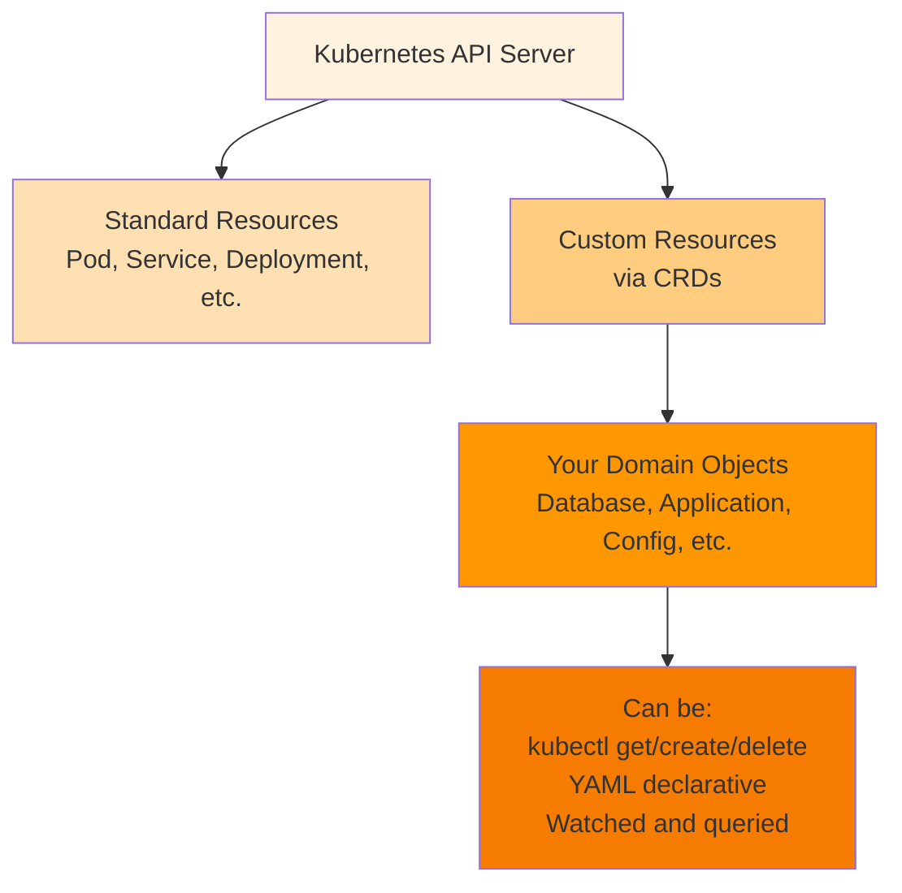
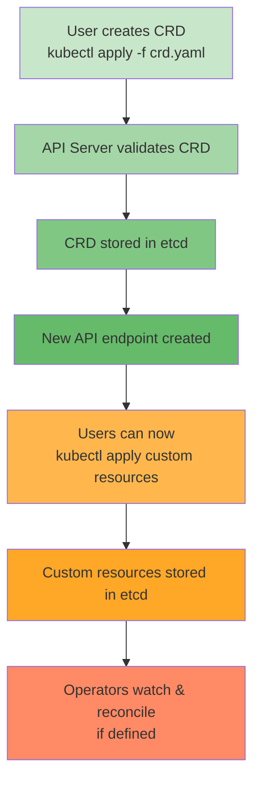
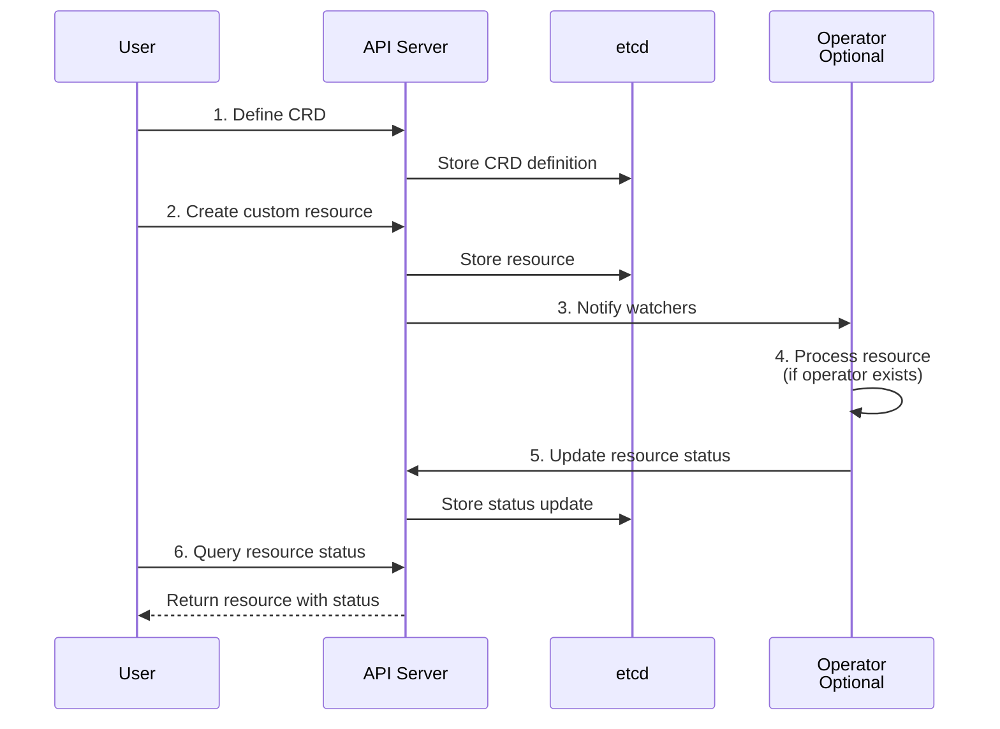
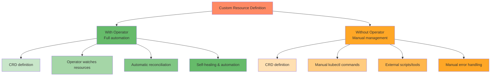
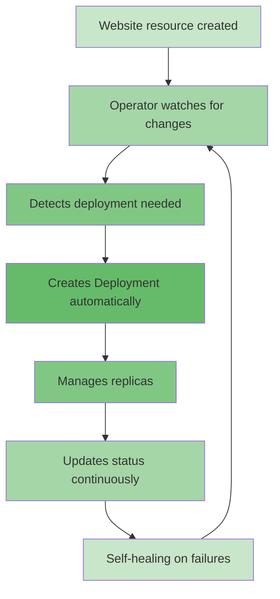
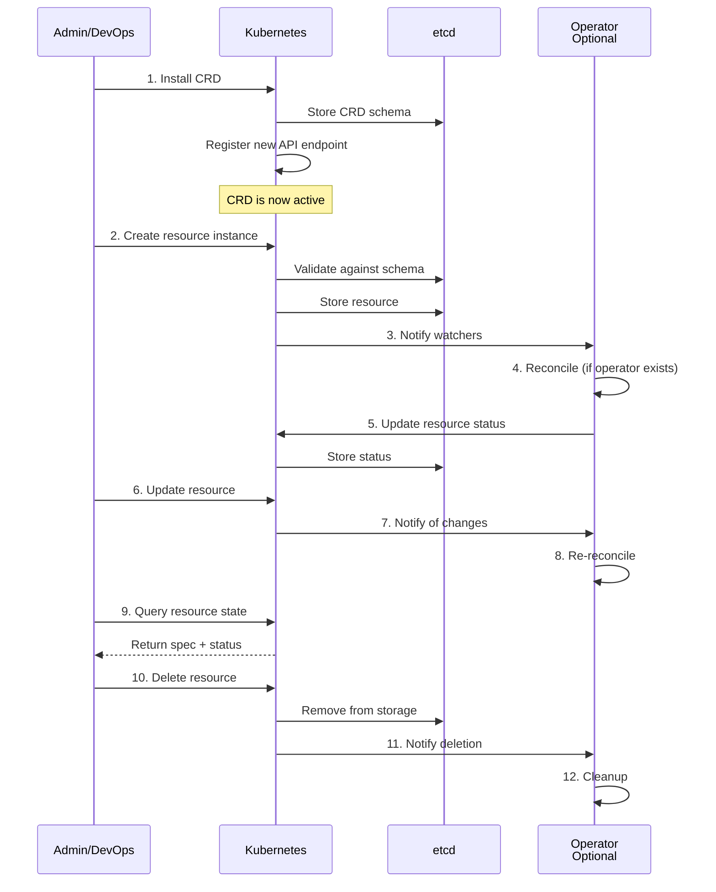

# Custom Resource Definitions (CRDs): Complete Guide

## What is a Custom Resource Definition (CRD)?

A **Custom Resource Definition (CRD)** is a Kubernetes API extension mechanism that allows you to define your own custom resources beyond the built-in resource types (like Pods, Deployments, Services, etc.). CRDs enable you to treat domain-specific objects as first-class Kubernetes resources.

### Key Concepts



### CRD Characteristics

- **API Extensions**: Extend the Kubernetes API without modifying core components
- **Declarative**: Define resources using YAML, just like native Kubernetes resources
- **Persistent Storage**: Stored in etcd (Kubernetes' data store)
- **Native Integration**: Full kubectl support, RBAC, events, watches
- **Validation**: Built-in OpenAPI schema validation
- **Multi-version**: Support multiple API versions for backwards compatibility
- **Status Subresources**: Separate spec (desired) from status (observed state)

---

## What Can CRDs Be Used For?

### 1. **Application Configuration**
Define custom resource types for your application's configuration needs:

```yaml
apiVersion: myapp.example.com/v1
kind: AppConfig
metadata:
  name: production-config
spec:
  environment: production
  replicas: 5
  region: us-east-1
```

### 2. **Infrastructure Management**
Create resources to manage infrastructure:

```yaml
apiVersion: infrastructure.example.com/v1
kind: Database
metadata:
  name: production-db
spec:
  type: postgresql
  size: large
  backupEnabled: true
  region: us-east-1
```

### 3. **Machine Learning Workflows**
Define ML training jobs, models, and pipelines:

```yaml
apiVersion: ml.example.com/v1
kind: TrainingJob
metadata:
  name: neural-net-v1
spec:
  datasetRef: training-data-v1
  model: neural-network
  epochs: 100
  batchSize: 32
```

### 4. **Multi-Tenant Applications**
Manage tenants and their configurations:

```yaml
apiVersion: saas.example.com/v1
kind: Tenant
metadata:
  name: acme-corp
spec:
  planName: enterprise
  seats: 100
  features:
    - sso
    - audit-logs
    - api-access
```

### 5. **CI/CD Pipelines**
Define pipeline configurations and runs:

```yaml
apiVersion: pipeline.example.com/v1
kind: Pipeline
metadata:
  name: build-and-deploy
spec:
  stages:
    - name: build
      image: golang:1.21
      script: make build
    - name: test
      image: golang:1.21
      script: make test
```

### 6. **Observability and Monitoring**
Create resources for custom monitoring:

```yaml
apiVersion: monitoring.example.com/v1
kind: AlertPolicy
metadata:
  name: high-latency-alert
spec:
  condition: p99_latency > 500ms
  duration: 5m
  actions:
    - email: ops@example.com
```

### 7. **Data Processing**
Define data processing jobs and workflows:

```yaml
apiVersion: data.example.com/v1
kind: DataPipeline
metadata:
  name: etl-daily
spec:
  schedule: "0 2 * * *"
  source: s3://raw-data
  transformations:
    - type: filter
      condition: quality > 0.8
    - type: aggregate
      groupBy: region
  destination: s3://processed-data
```

### 8. **Gaming and Simulations**
Define game world objects or simulation parameters:

```yaml
apiVersion: gaming.example.com/v1
kind: GameServer
metadata:
  name: us-east-1-server-1
spec:
  region: us-east-1
  maxPlayers: 100
  gameMode: pvp
  difficulty: hard
```

---

## How CRDs Work

### CRD Architecture



### Workflow Comparison



---

## Creating CRDs: With and Without Operators

### Approach Comparison



---

## Creating CRDs Without Operator

### Step 1: Define the CRD

```yaml
apiVersion: apiextensions.k8s.io/v1
kind: CustomResourceDefinition
metadata:
  name: websites.web.example.com
spec:
  group: web.example.com
  scope: Namespaced
  names:
    kind: Website
    plural: websites
    singular: website
    shortNames:
      - web
      - site
  versions:
    - name: v1
      served: true
      storage: true
      schema:
        openAPIV3Schema:
          type: object
          required:
            - spec
          properties:
            apiVersion:
              type: string
            kind:
              type: string
            metadata:
              type: object
            spec:
              type: object
              required:
                - domain
              properties:
                domain:
                  type: string
                  description: "Domain name for the website"
                  example: "example.com"
                ssl:
                  type: boolean
                  default: true
                  description: "Enable SSL/TLS"
                replicas:
                  type: integer
                  minimum: 1
                  maximum: 10
                  default: 1
                  description: "Number of replicas"
                image:
                  type: string
                  description: "Container image"
            status:
              type: object
              properties:
                phase:
                  type: string
                  enum:
                    - Pending
                    - Running
                    - Failed
                message:
                  type: string
                readyReplicas:
                  type: integer
      subresources:
        status: {}
```

### Step 2: Apply the CRD

```bash
kubectl apply -f website-crd.yaml
```

### Step 3: Create Custom Resource Instances

```yaml
apiVersion: web.example.com/v1
kind: Website
metadata:
  name: my-awesome-site
  namespace: default
spec:
  domain: mysite.com
  ssl: true
  replicas: 3
  image: nginx:latest
```

```bash
kubectl apply -f website-instance.yaml
```

### Step 4: Manage Resources Manually

Without an operator, you must handle management tasks manually:

```bash
# List all websites
kubectl get websites

# Get details
kubectl get websites my-awesome-site -o yaml

# Edit resource
kubectl edit website my-awesome-site

# Delete resource
kubectl delete website my-awesome-site

# Watch for changes
kubectl get websites --watch
```

### Step 5: External Automation (Scripts)

Create scripts to handle reconciliation:

```bash
#!/bin/bash
# Script to monitor and manage websites

while true; do
  # Get all websites
  kubectl get websites -o json | jq -r '.items[] | .metadata.name' | while read website; do
    
    # Check current state
    status=$(kubectl get website $website -o jsonpath='{.status.phase}')
    
    # Manual reconciliation logic
    if [ "$status" != "Running" ]; then
      echo "Website $website is not running, taking action..."
      # Custom logic to restore the website
      # e.g., create Deployment, Service, Ingress
    fi
  done
  
  sleep 30
done
```

### Limitations Without Operator
- ❌ Manual management of resources
- ❌ No automatic reconciliation
- ❌ External scripts required for automation
- ❌ No self-healing capabilities
- ❌ Complex error handling
- ❌ Difficult to maintain consistency

---

## Creating CRDs With Operator

### Complete Example with Operator

#### Step 1: Define the CRD (Same as before)

```yaml
apiVersion: apiextensions.k8s.io/v1
kind: CustomResourceDefinition
metadata:
  name: websites.web.example.com
spec:
  group: web.example.com
  scope: Namespaced
  names:
    kind: Website
    plural: websites
  versions:
    - name: v1
      served: true
      storage: true
      schema:
        openAPIV3Schema:
          type: object
          properties:
            spec:
              type: object
              properties:
                domain:
                  type: string
                replicas:
                  type: integer
                  default: 1
                image:
                  type: string
            status:
              type: object
              properties:
                phase:
                  type: string
                readyReplicas:
                  type: integer
      subresources:
        status: {}
```

#### Step 2: Create the Operator Controller

```go
package controllers

import (
    "context"
    
    appsv1 "k8s.io/api/apps/v1"
    corev1 "k8s.io/api/core/v1"
    apierrors "k8s.io/apimachinery/pkg/api/errors"
    metav1 "k8s.io/apimachinery/pkg/apis/meta/v1"
    "k8s.io/apimachinery/pkg/types"
    ctrl "sigs.k8s.io/controller-runtime"
    "sigs.k8s.io/controller-runtime/pkg/client"
    
    webv1 "my-operator/api/v1"
)

// WebsiteReconciler reconciles a Website object
type WebsiteReconciler struct {
    client.Client
}

// +kubebuilder:rbac:groups=web.example.com,resources=websites,verbs=get;list;watch;create;update;patch;delete
// +kubebuilder:rbac:groups=web.example.com,resources=websites/status,verbs=get;update;patch
// +kubebuilder:rbac:groups=apps,resources=deployments,verbs=get;list;watch;create;update;patch;delete

func (r *WebsiteReconciler) Reconcile(ctx context.Context, req ctrl.Request) (ctrl.Result, error) {
    // Fetch the Website resource
    website := &webv1.Website{}
    if err := r.Get(ctx, req.NamespacedName, website); err != nil {
        if apierrors.IsNotFound(err) {
            return ctrl.Result{}, nil
        }
        return ctrl.Result{}, err
    }
    
    // Check if Deployment exists
    deployment := &appsv1.Deployment{}
    err := r.Get(ctx, types.NamespacedName{
        Name:      website.Name,
        Namespace: website.Namespace,
    }, deployment)
    
    if err != nil && apierrors.IsNotFound(err) {
        // Create Deployment
        deployment = constructDeployment(website)
        if err := r.Create(ctx, deployment); err != nil {
            website.Status.Phase = "Failed"
            r.Status().Update(ctx, website)
            return ctrl.Result{}, err
        }
        website.Status.Phase = "Running"
    } else if err != nil {
        return ctrl.Result{}, err
    } else {
        // Update Deployment if needed
        if deploymentNeedsUpdate(deployment, website) {
            updateDeployment(deployment, website)
            if err := r.Update(ctx, deployment); err != nil {
                return ctrl.Result{}, err
            }
        }
    }
    
    // Update ready replicas
    website.Status.ReadyReplicas = deployment.Status.ReadyReplicas
    website.Status.Phase = "Running"
    if err := r.Status().Update(ctx, website); err != nil {
        return ctrl.Result{}, err
    }
    
    return ctrl.Result{RequeueAfter: 30 * time.Second}, nil
}

func constructDeployment(website *webv1.Website) *appsv1.Deployment {
    replicas := website.Spec.Replicas
    return &appsv1.Deployment{
        ObjectMeta: metav1.ObjectMeta{
            Name:      website.Name,
            Namespace: website.Namespace,
        },
        Spec: appsv1.DeploymentSpec{
            Replicas: &replicas,
            Selector: &metav1.LabelSelector{
                MatchLabels: map[string]string{"app": website.Name},
            },
            Template: corev1.PodTemplateSpec{
                ObjectMeta: metav1.ObjectMeta{
                    Labels: map[string]string{"app": website.Name},
                },
                Spec: corev1.PodSpec{
                    Containers: []corev1.Container{
                        {
                            Name:  "website",
                            Image: website.Spec.Image,
                            Ports: []corev1.ContainerPort{
                                {ContainerPort: 80},
                            },
                        },
                    },
                },
            },
        },
    }
}

func (r *WebsiteReconciler) SetupWithManager(mgr ctrl.Manager) error {
    return ctrl.NewControllerManagedBy(mgr).
        For(&webv1.Website{}).
        Owns(&appsv1.Deployment{}).
        Complete(r)
}
```

#### Step 3: Deploy the Operator

```bash
# Build the operator
make docker-build docker-push

# Deploy to cluster
kubectl apply -f config/rbac/
kubectl apply -f config/manager/
```

#### Step 4: Create Custom Resources

```yaml
apiVersion: web.example.com/v1
kind: Website
metadata:
  name: my-awesome-site
spec:
  domain: mysite.com
  replicas: 3
  image: nginx:latest
```

```bash
kubectl apply -f website-instance.yaml
```

#### Step 5: Automatic Management

The operator automatically:



### Benefits With Operator

✅ Automatic reconciliation  
✅ Self-healing capabilities  
✅ Intelligent scaling  
✅ Zero-downtime updates  
✅ Monitoring and observability  
✅ Error recovery  
✅ Declarative management  
✅ Complex orchestration  

---

## CRD Best Practices

### 1. **Schema Design**

```yaml
# ✅ Good: Clear, validated structure
spec:
  type: object
  required:
    - domain
  properties:
    domain:
      type: string
      minLength: 1
      pattern: '^[a-z0-9.-]+$'
    replicas:
      type: integer
      minimum: 1
      maximum: 100
    ttl:
      type: string
      description: "TTL format: 1h, 30m, 5s"
```

### 2. **Versioning**

```yaml
# Support multiple versions for backwards compatibility
versions:
  - name: v1
    served: true
    storage: true
  - name: v1alpha1
    served: true
    storage: false
    # Conversion rules from v1alpha1 to v1
```

### 3. **Status Subresources**

```yaml
# Always separate spec from status
spec:
  type: object
  # User-desired configuration
status:
  type: object
  # Observed state - updated by operator/controller

subresources:
  status: {}
```

### 4. **Validation**

```yaml
# Comprehensive validation rules
properties:
  port:
    type: integer
    minimum: 1
    maximum: 65535
  protocol:
    type: string
    enum:
      - HTTP
      - HTTPS
      - TCP
      - UDP
  replicas:
    type: integer
    minimum: 1
    maximum: 1000
```

### 5. **Conditions for Status**

```yaml
status:
  type: object
  properties:
    conditions:
      type: array
      items:
        type: object
        properties:
          type:
            type: string
          status:
            type: string
            enum:
              - "True"
              - "False"
              - "Unknown"
          reason:
            type: string
          message:
            type: string
          lastUpdateTime:
            type: string
            format: date-time
```

---

## Common CRD Patterns

### Pattern 1: Simple Configuration

```yaml
apiVersion: config.example.com/v1
kind: AppSettings
metadata:
  name: production
spec:
  logLevel: debug
  maxConnections: 1000
  timeout: 30s
```

### Pattern 2: Resource Management

```yaml
apiVersion: resources.example.com/v1
kind: ServiceQuota
metadata:
  name: team-alpha
spec:
  pods: 100
  cpus: 500m
  memory: 1Gi
  storage: 10Gi
```

### Pattern 3: Workflow/Pipeline

```yaml
apiVersion: workflow.example.com/v1
kind: Pipeline
metadata:
  name: data-processing
spec:
  steps:
    - name: extract
      image: extractor:v1
    - name: transform
      image: transformer:v1
    - name: load
      image: loader:v1
      depends: [transform]
  schedule: "0 0 * * *"
  retention: 7d
```

### Pattern 4: Declarative Infrastructure

```yaml
apiVersion: infra.example.com/v1
kind: Database
metadata:
  name: user-db
spec:
  engine: postgresql
  version: "14"
  storage:
    size: 100Gi
    type: ssd
  backup:
    enabled: true
    retention: 30d
  ha:
    enabled: true
    replicas: 3
```

---

## Lifecycle of a CRD



---

## Comparison Table

| Aspect | Without Operator | With Operator |
|--------|------------------|---------------|
| **Definition** | CRD only | CRD + Controller |
| **Management** | Manual/External scripts | Automatic reconciliation |
| **Reconciliation** | ❌ Not automated | ✅ Continuous |
| **Self-healing** | ❌ No | ✅ Yes |
| **Error handling** | Manual | Automatic retries |
| **Scalability** | Low | High |
| **Complexity** | Simple setup | More complex |
| **Operational load** | High | Low |
| **Use case** | Simple configs | Complex operations |
| **Best for** | Static resources | Dynamic management |

---

## Real-World Examples

### Example 1: WordPress CRD

```yaml
apiVersion: web.example.com/v1
kind: WordPress
metadata:
  name: my-blog
spec:
  domain: myblog.com
  title: "My Awesome Blog"
  admin:
    username: admin
    email: admin@myblog.com
  database:
    host: mysql.default
    port: 3306
  storage:
    size: 50Gi
  plugins:
    - akismet
    - yoast-seo
  theme: twentytwentythree
```

With an operator, this single resource would:
- Provision database
- Install WordPress
- Configure plugins and theme
- Setup backups
- Configure SSL
- Manage updates

### Example 2: Database Backup Policy

```yaml
apiVersion: backup.example.com/v1
kind: BackupPolicy
metadata:
  name: production-daily
spec:
  targetDatabase: production-db
  schedule: "0 2 * * *"
  retention: 30d
  verification:
    enabled: true
    method: restore-test
  notification:
    onSuccess: ops@example.com
    onFailure:
      - ops@example.com
      - backup-team@example.com
```

The operator would automatically:
- Schedule backups
- Execute backup jobs
- Verify backup integrity
- Manage retention policies
- Send notifications

---

## References

- [Kubernetes CRD Documentation](https://kubernetes.io/docs/tasks/extend-kubernetes/custom-resources/custom-resource-definitions/)
- [CRD Best Practices](https://kubernetes.io/docs/concepts/extend-kubernetes/api-extension/custom-resource-definitions/)
- [Kubebuilder CRD Tutorial](https://book.kubebuilder.io/cronjob-tutorial/gvk.html)
- [OpenAPI Schema Validation](https://kubernetes.io/docs/tasks/extend-kubernetes/custom-resources/custom-resource-definitions/#schema)
- [CRD Versioning](https://kubernetes.io/docs/tasks/extend-kubernetes/custom-resources/custom-resource-definition-versioning/)
