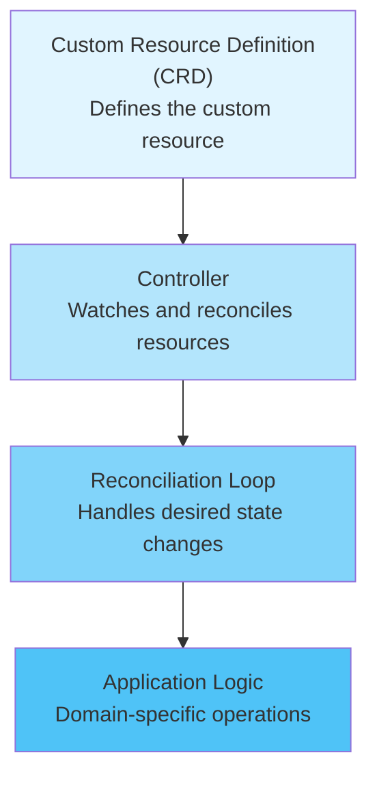
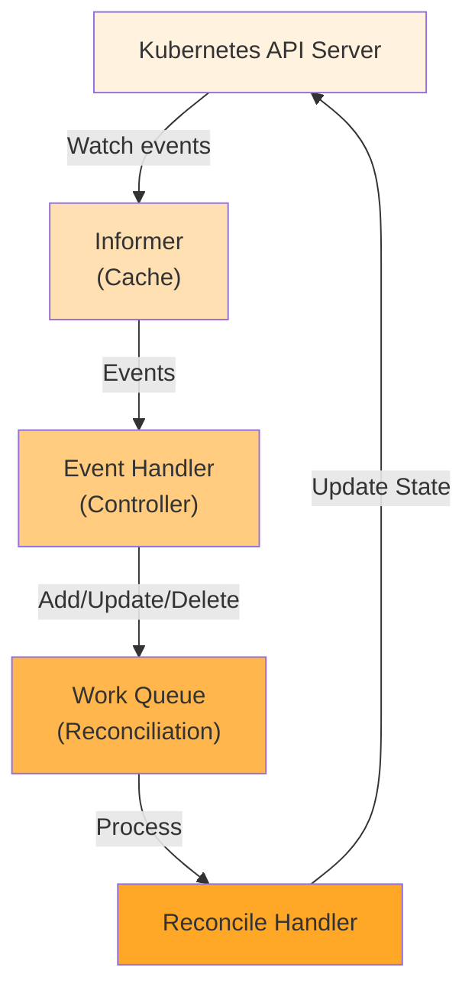
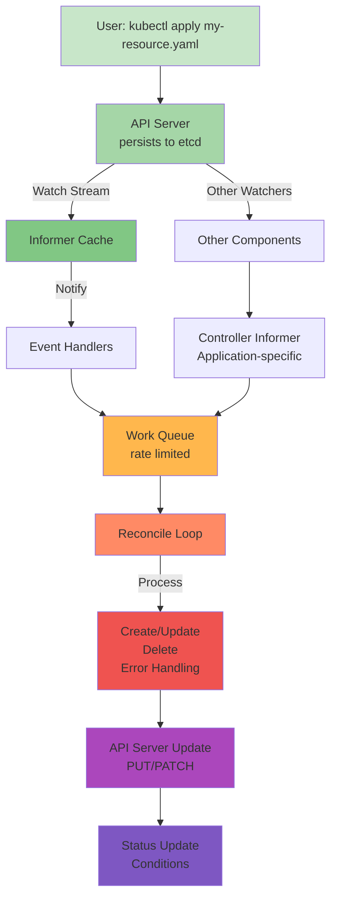
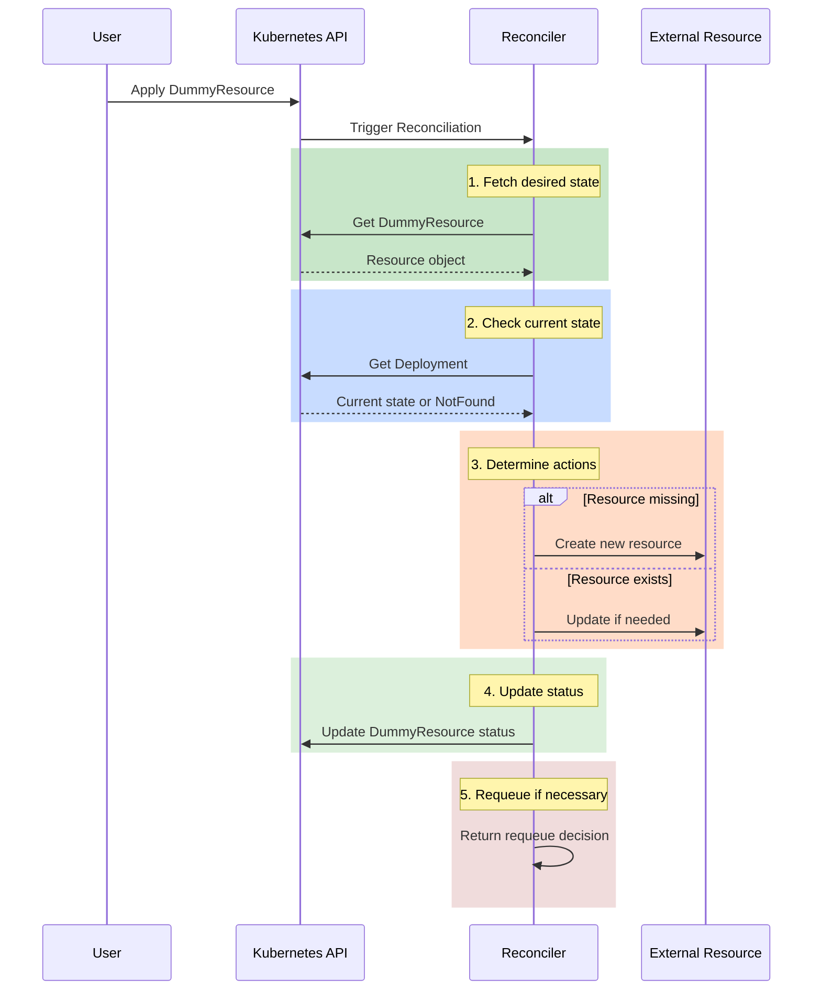
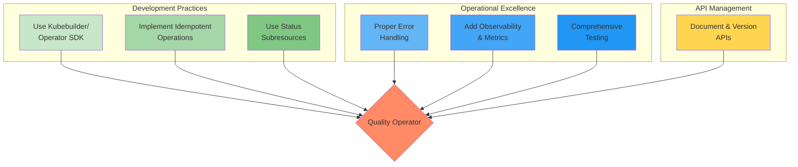

# Kubernetes Operators: Comprehensive Guide

## What is an Operator?

A Kubernetes Operator is a software extension to Kubernetes that uses Custom Resource Definitions (CRDs) and controllers to manage applications and their components. Operators encapsulate domain-specific operational knowledge and allow users to interact with complex applications using Kubernetes-native APIs and patterns.

### Key Characteristics

- **Domain Expertise**: Operators embed the operational knowledge of how to deploy, manage, and maintain applications
- **Custom Resources**: Define new Kubernetes resource types specific to your application
- **Automation**: Automatically perform complex tasks like provisioning, scaling, updates, and backups
- **Self-Healing**: Continuously reconcile the desired state with the actual state
- **Intelligent Lifecycle Management**: Handle complex operational scenarios beyond basic deployment

### Operator Anatomy



---

## What Can Operators Do?

### 1. **Provisioning and Configuration**
- Automatically provision infrastructure (databases, message queues, storage)
- Apply configuration management across clusters
- Initialize complex multi-component applications

### 2. **Scaling and Performance Management**
- Intelligent auto-scaling based on metrics and patterns
- Resource optimization and tuning
- Load balancing and traffic management

### 3. **Upgrades and Patches**
- Seamless version upgrades with zero downtime
- Rolling updates with health checks
- Automatic rollback on failures
- Database migrations during upgrades

### 4. **Backup and Disaster Recovery**
- Automated backup schedules
- Point-in-time recovery
- Cross-cluster replication
- Disaster recovery workflows

### 5. **Monitoring and Observability**
- Application health checks
- Metrics collection and export
- Log aggregation and management
- Alert generation and escalation

### 6. **Self-Healing and Resilience**
- Automatic failure detection and recovery
- Pod restart and node failover
- Circuit breaking and retry logic
- Dependency management

### 7. **Security and Access Control**
- Secret rotation and management
- TLS certificate provisioning
- RBAC policy enforcement
- Compliance monitoring

### 8. **Complex Operational Tasks**
- Database replication setup
- Cluster initialization and management
- Canary deployments
- Blue-green deployments

---

## Different Ways to Create Operators

### 1. **Operator SDK / Kubebuilder**

**Recommended for most use cases**

Using the Operator SDK or Kubebuilder framework:

```bash
kubebuilder init --domain example.com --repo my-operator
kubebuilder create api --group databases --version v1 --kind Postgres
```

**Advantages:**
- Code generation (deepcopy, clients, informers)
- Scaffolding and boilerplate automation
- Built-in testing framework
- Best practices enforced
- Active community support

**Typical Structure:**
```
my-operator/
├── config/
│   ├── crd/
│   ├── rbac/
│   └── manager/
├── api/
│   └── v1/
│       ├── types.go
│       └── groupversion_info.go
├── controllers/
│   └── myresource_controller.go
├── hack/
└── main.go
```

### 2. **Client-Go Library (Manual)**

**Low-level, full control**

Directly using Kubernetes Go client library:

```go
import "k8s.io/client-go/kubernetes"

clientset, _ := kubernetes.NewForConfig(config)
// Manually implement controller logic
```

**Advantages:**
- Maximum flexibility
- Lightweight
- No framework overhead
- Complete control over behavior

**Disadvantages:**
- Requires manual implementation of patterns
- More boilerplate code
- Harder to maintain

### 3. **Helm Operator**

**Simple operations with Helm charts**

Using Helm charts for resource management:

```yaml
apiVersion: helm.operators.coreos.com/v1alpha1
kind: HelmRelease
metadata:
  name: my-release
spec:
  chart:
    repository: https://charts.example.com
    name: my-chart
    version: 1.0.0
```

**Advantages:**
- Leverage existing Helm charts
- Minimal code required
- Good for application deployment

**Disadvantages:**
- Limited operational sophistication
- Cannot implement complex reconciliation logic

### 4. **Ansible Operator**

**For Ansible playbooks integration**

Wrap Ansible playbooks in operators:

```yaml
apiVersion: example.com/v1alpha1
kind: MyApp
metadata:
  name: myapp-instance
spec:
  package_name: myapp
  version: "1.0"
```

**Advantages:**
- Leverage existing Ansible knowledge
- Good for infrastructure automation
- Declarative configuration management

**Disadvantages:**
- Performance overhead
- Limited by Ansible capabilities

### 5. **Java Operator SDK**

**For Java/JVM environments**

Using Java Operator SDK framework:

```java
@ControllerConfiguration
public class MyResourceController implements ResourceController<MyResource> {
    // Reconciliation logic
}
```

**Advantages:**
- Native for Java/Spring applications
- Type-safe
- IDE support and tooling

### 6. **Custom Implementation**

**Complete freedom**

Build from scratch using any approach:

```go
// Implement custom reconciliation logic
// Use informers, work queues, and client-go
```

**Advantages:**
- Complete control
- Tailored for specific needs
- No framework constraints

**Disadvantages:**
- High complexity
- More bugs and edge cases
- Maintenance burden

---

## Communication Mechanism Between Operator and Kubernetes

### 1. **Watch-Based Reconciliation**

The primary communication pattern:



### 2. **Key Communication Components**

#### **Watch and Informer Pattern**
```go
informer := factory.Apps().V1().Deployments().Informer()
informer.AddEventHandler(cache.ResourceEventHandlerFuncs{
    AddFunc: controller.onAdd,
    UpdateFunc: controller.onUpdate,
    DeleteFunc: controller.onDelete,
})
```

- **Watch**: Stream of events from API server
- **Informer**: Caches and filters events
- **EventHandler**: Responds to state changes

#### **Work Queue**
```go
queue := workqueue.NewNamedRateLimitingQueue(
    workqueue.DefaultControllerRateLimiter(),
    "MyQueue",
)
```

- **Decoupling**: Separates event detection from processing
- **Retry Logic**: Automatic retry with exponential backoff
- **Rate Limiting**: Prevents API server overload
- **Idempotency**: Safe to reprocess items

#### **RESTful API Calls**
```go
// Get resource
resource, err := clientset.MyGroup().V1alpha1().MyResources(ns).Get(ctx, name)

// Update resource
resource.Status.Phase = "Ready"
clientset.MyGroup().V1alpha1().MyResources(ns).UpdateStatus(ctx, resource)

// Update metadata/spec
clientset.MyGroup().V1alpha1().MyResources(ns).Update(ctx, resource)
```

### 3. **Event Flow Diagram**



### 4. **Reconciliation Cycle**



**Reconciliation Code Example:**

```go
func (r *MyResourceReconciler) Reconcile(ctx context.Context, req Request) (Result, error) {
    // 1. Fetch the desired state
    resource := MyResource{}
    if err := r.Get(ctx, req.NamespacedName, &resource); err != nil {
        // Handle deletion or errors
    }
    
    // 2. Check current state
    deployment := &appsv1.Deployment{}
    err := r.Get(ctx, types.NamespacedName{
        Name:      resource.Name,
        Namespace: resource.Namespace,
    }, deployment)
    
    // 3. Determine actions
    if err != nil && apierrors.IsNotFound(err) {
        // Create resources
        deployment = constructDeployment(resource)
        r.Create(ctx, deployment)
    } else {
        // Update if necessary
        if deploymentNeedsUpdate(deployment, resource) {
            r.Update(ctx, deployment)
        }
    }
    
    // 4. Update status
    resource.Status.Phase = "Ready"
    r.Status().Update(ctx, &resource)
    
    // 5. Requeue if necessary
    return Result{Requeue: true, RequeueAfter: 30 * time.Second}, nil
}
```

### 5. **API Patterns Used**

| Operation | API Method | Usage |
|-----------|-----------|-------|
| **Watch** | Watch/WatchList | Monitor resource changes |
| **Get** | GET | Fetch current state |
| **Create** | POST | Create new resources |
| **Update** | PUT | Replace entire resource |
| **Patch** | PATCH | Partial updates |
| **Delete** | DELETE | Remove resources |
| **Status** | PUT/PATCH | Update status subresource |

---

## Popular Libraries in Go to Create Operators

### 1. **Kubebuilder** ⭐⭐⭐⭐⭐

**Most Popular and Recommended**

```go
// Example using Kubebuilder
func (r *MyResourceReconciler) Reconcile(ctx context.Context, req ctrl.Request) (ctrl.Result, error) {
    myResource := &v1alpha1.MyResource{}
    if err := r.Get(ctx, req.NamespacedName, myResource); err != nil {
        // Handle error
    }
    // Reconciliation logic
}
```

**Features:**
- Built on controller-runtime
- Code generation (deepcopy, clients)
- Scaffold generation
- Webhook support
- Testing framework
- Documentation generation

**Website:** https://kubebuilder.io

---

### 2. **Operator SDK** ⭐⭐⭐⭐⭐

**Official CNCF Project**

```bash
operator-sdk new my-operator --type go
operator-sdk add api --api-version=mygroup.com/v1alpha1 --kind=MyResource
operator-sdk add controller --api-version=mygroup.com/v1alpha1 --kind=MyResource
```

**Features:**
- Official project structure
- Multiple operator patterns (Go, Helm, Ansible)
- Testing utilities
- Continuous integration templates
- Deployment helpers

**Website:** https://sdk.operatorframework.io

---

### 3. **Controller-Runtime** ⭐⭐⭐⭐

**Low-Level Foundation Library**

```go
import "sigs.k8s.io/controller-runtime/pkg/client"

mgr, err := ctrl.NewManager(cfg, ctrl.Options{})
if err != nil {
    // handle error
}

if err := (&MyResourceReconciler{}).SetupWithManager(mgr); err != nil {
    // handle error
}

mgr.Start(ctrl.SetupSignalHandler())
```

**Features:**
- Reconciliation pattern implementation
- Client abstraction
- Webhook support
- Manager and cache handling
- Event recording

**Repository:** https://github.com/kubernetes-sigs/controller-runtime

---

### 4. **Client-Go** ⭐⭐⭐⭐

**Official Kubernetes Go Client**

```go
import "k8s.io/client-go/kubernetes"

clientset, err := kubernetes.NewForConfig(config)
deployments, err := clientset.AppsV1().Deployments("default").List(ctx, metav1.ListOptions{})
```

**Features:**
- Low-level API access
- Informers and listers
- Work queues
- Rate limiting
- Complete API coverage

**Repository:** https://github.com/kubernetes/client-go

---

### 5. **Metacontroller** ⭐⭐⭐

**Dynamic Control via Webhooks**

```yaml
apiVersion: metacontroller.k8s.io/v1alpha1
kind: CompositeController
metadata:
  name: my-controller
spec:
  generateSelector: true
  parentResources:
  - apiVersion: example.com/v1
    resource: myresources
  childResources:
  - apiVersion: apps/v1
    resource: deployments
  hooks:
    sync:
      webhook:
        url: http://my-operator:8080/sync
```

**Features:**
- Write operators in any language (webhook-based)
- Focuses on composition
- Reduces boilerplate
- Good for simple operations

**Repository:** https://github.com/metacontroller/metacontroller

---

### 6. **Kopf** ⭐⭐⭐

**Python-based (For Reference)**

While this is a Python library, it shows alternative approaches:

```python
@kopf.on.event('mygroup', 'v1alpha1', 'myresources')
def on_my_resource_event(event, **kwargs):
    # Reconciliation logic
```

**Note:** This is Python, not Go, but included for architectural reference.

---

### 7. **Kube-Builder (Alternative Framework)** ⭐⭐

**Lighter-weight alternative to Kubebuilder**

```go
// More manual but simpler
type MyReconciler struct {
    client.Client
    Log logr.Logger
}

func (r *MyReconciler) ReconcileMyResource(ctx context.Context, obj *MyResource) error {
    // Reconciliation logic
}
```

---

### 8. **Envoy Proxy API** ⭐⭐

**Specialized for service mesh operators**

For building operators that manage Envoy proxy configurations.

---

## Comparison Table

| Library | Language | Level | Community | Best For |
|---------|----------|-------|-----------|----------|
| Library | Language | Level | Community | Best For |
|---------|----------|-------|-----------|----------|
| **Kubebuilder** | Go | High | ⭐⭐⭐⭐⭐ | General operators |
| **Operator SDK** | Multiple | High | ⭐⭐⭐⭐⭐ | Enterprise operators |
| **Controller-Runtime** | Go | Low | ⭐⭐⭐⭐ | Custom implementations |
| **Client-Go** | Go | Very Low | ⭐⭐⭐⭐⭐ | Fine-grained control |
| **Metacontroller** | Any | High | ⭐⭐⭐ | Simple composition |
| **Kopf** | Python | High | ⭐⭐⭐⭐ | Python-based projects |

---

## Best Practices for Operator Development



### Detailed Best Practices:

1. **Use Kubebuilder/Operator SDK**
   - Start with scaffolding
   - Follow established patterns
   - Leverage code generation

2. **Implement Idempotent Operations**
   - Same input should always produce same result
   - Safe to reprocess without side effects

3. **Use Status Subresources**
   - Separate spec (desired) from status (observed)
   - Update status independently from spec

4. **Implement Proper Error Handling**
   - Return retryable errors
   - Implement exponential backoff
   - Log meaningful error messages

5. **Add Observability**
   - Log reconciliation steps
   - Record events
   - Export metrics

6. **Write Comprehensive Tests**
   - Unit tests for business logic
   - Integration tests with Kubernetes
   - E2E tests

7. **Document and Version APIs**
   - Clear API documentation
   - Version your CRDs
   - Support multiple versions

---

## Example Operator Architecture

```mermaid
graph TD
    Root["my-operator/"]
    
    Root --> API["api/v1alpha1/"]
    API --> API1["myresource_types.go<br/>CRD types"]
    API --> API2["myresource_webhook.go<br/>Validation/mutation"]
    API --> API3["groupversion_info.go<br/>Group/version info"]
    
    Root --> Controllers["controllers/"]
    Controllers --> Ctrl1["myresource_controller.go<br/>Reconciliation logic"]
    Controllers --> Ctrl2["myresource_controller_test.go"]
    
    Root --> Config["config/"]
    Config --> Conf1["crd/<br/>CRD manifests"]
    Config --> Conf2["rbac/<br/>RBAC rules"]
    Config --> Conf3["manager/<br/>Manager deployment"]
    Config --> Conf4["samples/<br/>Example resources"]
    
    Root --> Hack["hack/"]
    Hack --> Hack1["boilerplate.go.txt<br/>Code generation headers"]
    
    Root --> Main["main.go<br/>Operator entrypoint"]
    Root --> Mod["go.mod<br/>Dependencies"]
    Root --> Docker["Dockerfile<br/>Container build"]
    Root --> Make["Makefile<br/>Build targets"]
    
    style Root fill:#ff8a65
    style API fill:#64b5f6
    style Controllers fill:#64b5f6
    style Config fill:#64b5f6
    style Hack fill:#64b5f6
    style Main fill:#81c784
    style Mod fill:#81c784
    style Docker fill:#81c784
    style Make fill:#81c784
```



---

## References

- [Kubernetes Operator Documentation](https://kubernetes.io/docs/concepts/extend-kubernetes/operator/)
- [Kubebuilder Book](https://book.kubebuilder.io)
- [Operator SDK Docs](https://sdk.operatorframework.io)
- [OperatorHub.io](https://operatorhub.io) - Registry of operators
- [Controller-Runtime API Reference](https://pkg.go.dev/sigs.k8s.io/controller-runtime)
